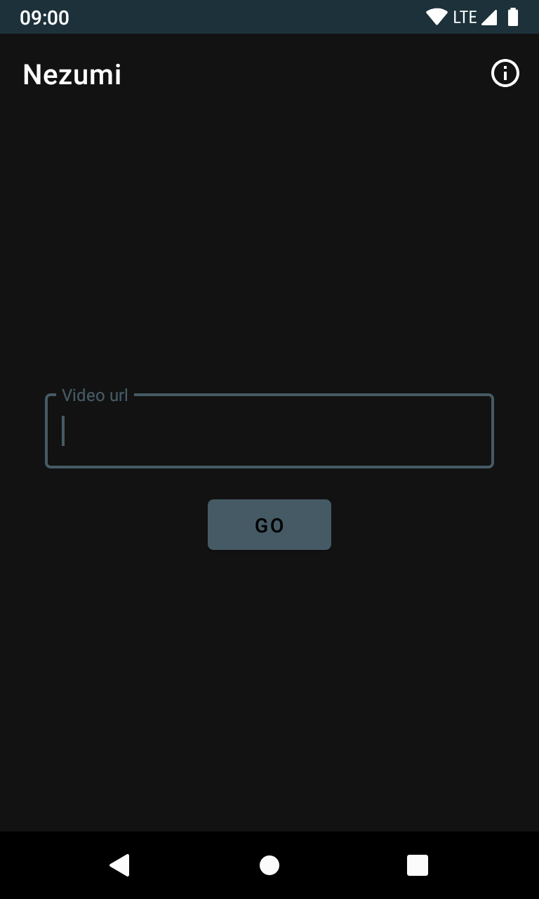

# About

*This project is part of a series of small and quick projects created to have some code references for future creations. Be aware, these projects are not focused on best practices, testing or code quality in general, their purpose is to be the first steps to a more solid implementation.*

"Nezumi" is an Android application that allows you to download videos from a known video platform to your device. This app translates some of the functionality of other of my projects ([dsc](https://github.com/spun/dsc)) to Android/kotlin. The app can fail to download some videos, for a more up-to-date compatibility with a wider number of urls, check the original [dsc](https://github.com/spun/dsc) project.

## What does this project use

What can this project offer as a reference for the future?

- [x] [Kotlin serialization](https://github.com/Kotlin/kotlinx.serialization)
- [x] ~~Android DownloadManager API~~
- [x] OkHTTP custom download service
- [x] Permissions using `registerForActivityResult`
- [x] Copy to clipboard

## How to run

Open the project in AndroidStudio and run the application.

## Screenshots

---

Logo from [Twemoji](https://twemoji.twitter.com/ "Twemoji") licensed under [CC-BY 4.0](https://creativecommons.org/licenses/by/4.0/ "CC-BY 4.0")
